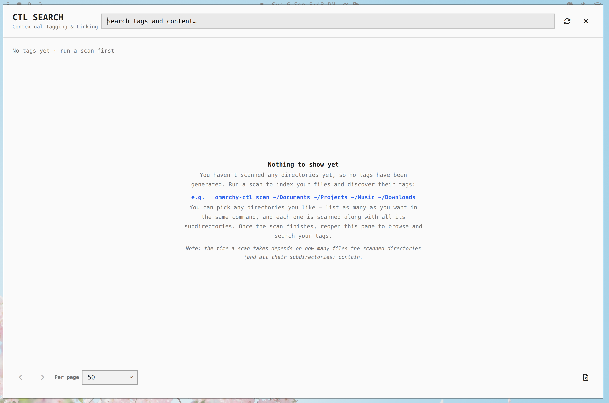

# Contextual Tagging & Linking (CTL) for Omarchy

CTL automatically tags your files based on their content and metadata, lets you link related files, and search everything from a bar widget or the CLI.

## Install

```bash
omarchy plugin add https://github.com/MBhalkar/omarchy-ctl.git
```

### Prerequisites

- **python-pip** — required to install Python dependencies. Install it first:

  ```bash
  sudo pacman -S python-pip
  ```

### Post-Install

```bash
bash ~/.config/omarchy/plugins/mbhalkar.ctl/scripts/install.sh
systemctl --user enable --now omarchy-ctl.service
```

After that, use `omarchy-ctl` from the CLI.

### Bar Widget

The install script also installs a Quickshell bar widget ("CTL Search", left section by default). Move it to your preferred bar section:

```bash
omarchy bar move mbhalkar.ctl --section left
```

You can also place it in `center` or `right`. Click the widget in the bar to open the search panel. Right-click the widget to reload tags.

## Search Panel

- Type in the search box (or click a tag chip) and hit Enter to search by tag or content.
- Results are paginated — use the pager arrows (or PageUp/PageDown) and the per-page dropdown (10 / 25 / 50 / 100 / 250 / All).
- Click a result to open the file.
- Click the Excel icon (bottom right) to export all results for the query to an `.xlsx` file in `~/Downloads`.
- Click the reload icon to refresh the tag list (and re-run the current search). Esc clears the search, Esc again closes the panel.

## First-Time Experience

When you open the panel before any scan has been run, no tags exist yet. Instead of showing an empty panel, CTL greets you with a guided message that explains how to get started:



To generate your tags, scan the directories you care about. You can list multiple directories in a single command:

```bash
omarchy-ctl scan ~/Documents ~/Projects ~/Music ~/Downloads
```

Once the scan finishes, reopen the panel to browse and search your tags. Note that scan time depends on how many files the scanned directories (and all their subdirectories) contain.

## CLI Usage

| Command | Description |
|---------|-------------|
| `omarchy-ctl scan <paths...>` | Scan files and generate tags |
| `omarchy-ctl search <query> [--limit N] [--offset N]` | Search files by tags or content (paged, 50 per page by default) |
| `omarchy-ctl export <query> [--output PATH]` | Export all results for a query to an Excel file (defaults to `~/Downloads/ctl_export.xlsx`) |
| `omarchy-ctl tags` | List all tags |
| `omarchy-ctl link <source> <target> [relation]` | Create a link between two files |
| `omarchy-ctl status` | Show CTL daemon status |

Note: `export` needs the `openpyxl` package (`pip install openpyxl`) if it isn't already installed.

## Data & Configuration

- Index database (SQLite + full-text search): `~/.local/share/omarchy-ctl/omarchy-ctl.db`
- Encryption key: `~/.config/omarchy-ctl/encryption.key`
- Local IPC socket: `~/.local/share/omarchy-ctl/omarchy-ctl.sock`
- Sample config: `config/omarchy-ctl.toml` (scanner paths, storage paths, server socket)

## License

MIT License - see [LICENSE](LICENSE) for details.
